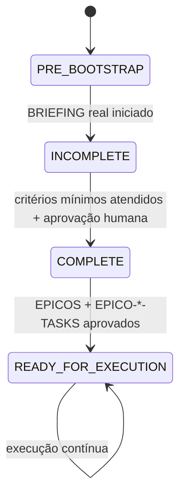
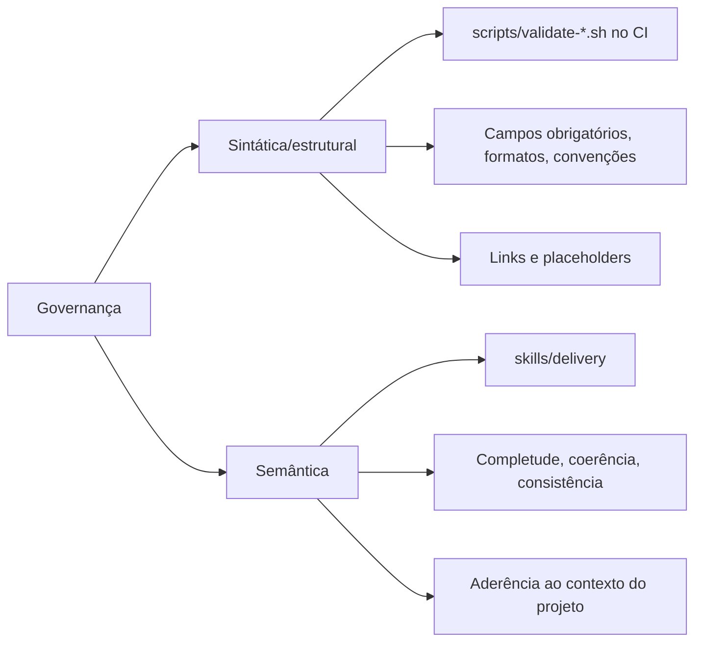
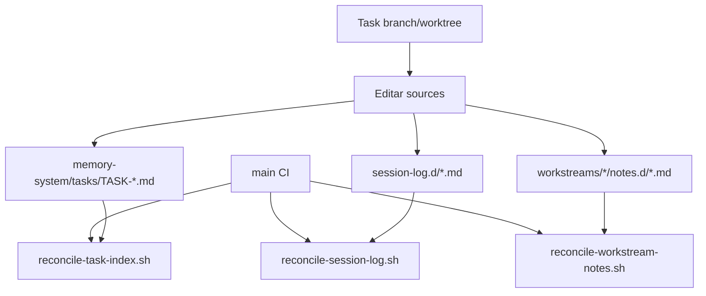
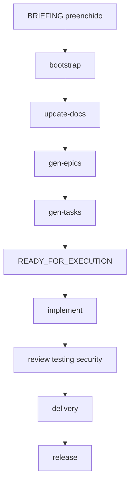

# Guia Completo do Boilerplate Multi-IA

Este guia consolida e organiza, em um único lugar, as regras e capacidades do boilerplate para desenvolvimento com IA.

Objetivo: permitir que qualquer pessoa entenda como usar o boilerplate de ponta a ponta, do bootstrap à execução contínua de tarefas, sem depender de ajuda externa.

## 1. Comece Aqui

### 1.1 O que este boilerplate resolve

Este boilerplate padroniza um fluxo de desenvolvimento assistido por IA com:

- Governança clara (sintática no CI + semântica via skill de delivery).
- Memória operacional por tarefas e workstreams.
- Catálogo de skills interoperável entre providers.
- Estrutura de documentação e templates para planejamento/execução/entrega.
- Regras para colaboração paralela com `git worktree`.

### 1.2 Para quem ele é indicado

- Times que usam IA no ciclo inteiro (planejamento, implementação, validação e entrega).
- Projetos que precisam rastreabilidade entre requisito, critério de aceite e evidência.
- Equipes com múltiplos agentes trabalhando em paralelo.

### 1.3 O que você recebe pronto

- Contrato operacional central: [AGENTS.md](../AGENTS.md)
- Política de integridade: [INTEGRITY-RULES.md](../INTEGRITY-RULES.md)
- Adaptação Claude: [CLAUDE.md](../CLAUDE.md)
- Estrutura de documentação de produto/arquitetura: `docs/`
- Sistema de memória/tarefas/templates: `memory-system/`
- Scripts de validação e reconciliação: `scripts/`
- Skills canônicas: `skills/*/SKILL.md`

## 2. Fontes de Verdade e Ordem de Leitura

Quando houver dúvida, use esta ordem:

1. [AGENTS.md](../AGENTS.md): contrato operacional principal.
2. [CLAUDE.md](../CLAUDE.md): adaptações específicas de provider.
3. [INTEGRITY-RULES.md](../INTEGRITY-RULES.md): regras de qualidade/honestidade.
4. [docs/PROJECT_SPECS.md](../docs/PROJECT_SPECS.md): fonte de verdade funcional do projeto.
5. `docs/*`: documentação de produto, arquitetura e decisões.
6. `memory-system/*`: execução operacional (tarefas, logs, notas e templates).

Regra explícita: se `CLAUDE.md` conflitar com `AGENTS.md`, prevalece `AGENTS.md`.
`skills/*` são mecanismos operacionais de execução (playbooks), não fonte de verdade documental.

## 3. Estrutura do Repositório

## 3.1 Mapa rápido

```text
.
├── .agents/skills -> ../skills            # Descoberta de skills no Codex
├── .claude/
│   ├── agents/*.md                        # Agentes especialistas usados no Claude
│   └── skills -> ../skills                # Skills de fluxo disponíveis no Claude
├── .github/workflows/governance.yml       # CI de governança
├── boilerplate-docs/                      # Documentação do próprio boilerplate
├── docs/                                  # Documentação do projeto derivado
│   ├── specs/                             # Specs estendidas para projetos complexos
│   ├── reviews/                           # Saída de review-spec e review-all
│   └── PREREQUISITES.md                   # Pré-requisitos humanos para execução automatizada
├── memory-system/                         # Tarefas, logs, templates e workstreams
├── scripts/                               # Validações e utilitários de fluxo
├── skills/                                # Skills canônicas (fluxo + especialistas)
└── src/                                   # Código-fonte de aplicação
```

## 3.2 Papel de cada área

- `boilerplate-docs/`: como usar/evoluir o boilerplate.
- `docs/`: documentação funcional e arquitetural do projeto derivado.
  - `docs/specs/`: especificações estendidas para projetos complexos (specs de domínio, nomes em kebab-case).
  - `docs/PREREQUISITES.md`: pré-requisitos humanos para execução automatizada (gerado pelo bootstrap).
  - `docs/reviews/`: saída das skills review-spec e review-all.
- `memory-system/`: operação diária de tarefas, memória e templates.
- `scripts/`: automação de governança e colaboração.
- `skills/`: instruções especializadas reutilizáveis.
- `src/`: única área válida para código de aplicação (ou `*/src/` em monorepo).

## 4. Governança Operacional

## 4.1 Regras de ouro (resumo)

- KISS, YAGNI, DRY.
- Sem código sem planejamento.
- Corrigir causa raiz, nunca mascarar sintoma.
- Nunca manipular teste para “passar”.
- Registrar decisões e resultados.

## 4.2 Gate 0 (bootstrap) e estados



Estados:

- `PRE_BOOTSTRAP`: briefing ainda template.
- `INCOMPLETE`: briefing real iniciado; docs ainda evoluindo.
- `COMPLETE`: bootstrap pronto para decompor em épicos.
- `READY_FOR_EXECUTION`: épicos/tarefas aprovados; execução normal liberada.

Observação importante: Gate 0 é advisory (warning), não bloqueio sintático absoluto.

## 4.3 Modos de execução

| Modo | Quando usar | Planejamento/artefatos | Aprovação humana | Testes mínimos | Evidência para fechar |
|---|---|---|---|---|---|
| `Quick` | baixo risco, sem contrato/schema/infra, até 3 arquivos, até ~2h | planejamento mínimo no task item | não obrigatória por default | `unit` ou `manual` verificável | `Evidence` com `PASS/FAIL` + comando/check |
| `Standard` | modo padrão | `Planning`; `Report` ao concluir | obrigatória em ambiguidade/alto risco | seleção por risco (`unit/integration/e2e/manual`) | rastreabilidade requisito -> critério -> teste + evidências |
| `Critical` | segurança, migração de dados, breaking change, deploy sensível, alto risco | `Planning`; `Report` ao concluir | obrigatória em gates de arquitetura, testes e integração | `unit` + `integration` (e `e2e` quando aplicável) | rastreabilidade completa e evidência explícita por critério |

## 4.4 Governança sintática x semântica



- Sintática: rápida, objetiva, automática (CI).
- Semântica: contextual, natural language, conduzida por `skills/delivery` + humano.

## 4.5 Critérios mínimos para bootstrap `COMPLETE`

`docs/PROJECT_SPECS.md` deve ter:

- nome do produto, objetivo principal, problema e público-alvo preenchidos.
- pelo menos 1 item em `Escopo -> Incluído`.
- pelo menos 1 requisito funcional (`RF-XXX`) preenchido.
- pelo menos 1 critério de aceite (`CA-XXX`) preenchido.
- `Última atualização` com data real.
- Seção 10 (Decision Criteria) presente.

`docs/PREREQUISITES.md` deve ter:

- arquivo existente e revisado (conteúdo real ou justificativa de não-aplicabilidade).

`memory-system/1-project-context.md` deve ter:

- `Name`, `Type`, `Status` e `Last Updated` com valores reais.
- pelo menos 1 item em `Project Goals`.
- pelo menos 1 item em `Active Development Areas`.

## 4.6 Modelo de estados de task

Estados válidos:

- `PENDING`
- `IN_PROGRESS`
- `BLOCKED`
- `COMPLETED`
- `CANCELED`

Transições válidas:

- `PENDING -> IN_PROGRESS | CANCELED`
- `IN_PROGRESS -> BLOCKED | COMPLETED | CANCELED`
- `BLOCKED -> IN_PROGRESS | CANCELED`

## 4.7 Exceção docs-only direto em `main`

Fluxo direto em `main` é permitido somente para mudanças de documentação:

- qualquer arquivo `**/*.md`
- `docs/**`
- `memory-system/**`
- `boilerplate-docs/**`
- `.claude/agents/**`
- `skills/*/references/**`

Se qualquer arquivo alterado sair desse escopo, o fluxo obrigatório volta a ser branch de task + PR + CI.

Comando recomendado:

```bash
./skills/delivery/scripts/deliver-to-main.sh --docs-main
```

## 4.8 Como usar skills no dia a dia (workflow x especialista)

Resumo:

- Skill de fluxo: executa processo fim a fim.
- Skill especialista: faz análise técnica pontual.

Detalhamento completo e exemplos de acionamento: seção 8.

## 5. Memória Operacional e Workstreams

## 5.1 Componentes principais

- `memory-system/1-project-context.md`: contexto executivo do projeto.
- `memory-system/2-tasks.md`: quadro consolidado e status de bootstrap.
- `memory-system/tasks/TASK-*.md`: fonte de verdade por tarefa.
- `memory-system/task-docs/`: planning/report/validação de entrega.
- `memory-system/session-log.d/*.md`: fragmentos append-only por sessão.
- `memory-system/session-log.md`: consolidado (gerado na `main`).

## 5.2 Workstreams

- Estrutura: `memory-system/workstreams/<workstream>/`.
- Arquivos típicos:
  - `notes.d/*.md` (fragmentos append-only)
  - `notes.md` (consolidado)
  - `history.md`

Mapeamento skill -> workstream:

- padrão: skill `X` usa workstream `X`.
- exceções por alias em [aliases.conf](../memory-system/workstreams/aliases.conf).

Aliases padrão do boilerplate:

- `bootstrap=architect`
- `delivery=devops`
- `release=devops`
- `gen-executive-summary=architect`
- `gen-epics=architect`
- `gen-tasks=architect`
- `gen-skill=architect`
- `gohorse=development`
- `gohorse-light=development`
- `implement=development`
- `xgh=development`
- `parallel=development`
- `update-docs=architect`
- `update-upstream=devops`
- `review-spec=architect`
- `review-all=architect`
- `smoke-claude-tmux=devops`
- `solve-issues=development`
- `ep-check=testing`

## 5.3 Como conflitos são mitigados



Também há proteção via `.gitattributes`:

- Consolidados com `merge=ours` (`2-tasks.md`, `session-log.md`, `notes.md`).
- Fragmentos com `merge=union` (`*.d/*.md`).

## 6. Entregáveis Obrigatórios por Etapa

Resumo objetivo por estado:

| Estado | Arquivos/condições mínimas |
|---|---|
| `PRE_BOOTSTRAP` | `BRIEFING.md` ainda inicial + templates base existentes (`PROJECT_SPECS`, `1-project-context`, `2-tasks`) |
| `INCOMPLETE` | `BRIEFING.md` já real + primeira versão útil de `PROJECT_SPECS` e `1-project-context` |
| `COMPLETE` | critérios mínimos de bootstrap atendidos + aprovação humana para decomposição em épicos |
| `READY_FOR_EXECUTION` | `docs/EPICOS.md` aprovado + ao menos um `docs/EPICO-<ID>-<slug>-TASKS.md` aprovado + aprovação humana |

Observação: detalhes completos dos critérios ficam nas seções 4.2 e 4.5.

## 6.1 Execução de task

Sempre obrigatório (todos os modos):

- `memory-system/tasks/TASK-<github-login>-<task-key>.md` com campos mandatórios.

Obrigatório por modo:

- `Quick` concluído: campo `Evidence` (`PASS/FAIL` + comando/check).
- `Standard/Critical` em andamento: `Planning`.
- `Standard/Critical` concluído: `Report`.

Memória operacional ao concluir:

- Fragmento em `session-log.d/`.
- Fragmento em `workstreams/<ws>/notes.d/` para workstreams relevantes.

## 7. Playbooks de Fluxo de Trabalho (Fim a Fim)

## 7.1 Mapa Geral da Jornada



Use este mapa como sequência padrão para operação humana no boilerplate.

## 7.2 Playbook A: Bootstrap Completo

Quando usar:

- início do projeto (`PRE_BOOTSTRAP` ou `INCOMPLETE`).

O bootstrap suporta dois modos: projetos simples (apenas BRIEFING) e projetos complexos (BRIEFING + specs pré-autorais em `docs/specs/`).

Skills principais:

- `bootstrap` (workflow)
- `update-docs` (workflow)
- `delivery` (workflow, docs-only quando aplicável)

Passo a passo:

1. Preencher `BRIEFING.md` com descrição real do projeto.
2. Acionar bootstrap:
   - Claude: `/bootstrap iniciar bootstrap a partir do BRIEFING`
   - Codex: `Use a skill bootstrap para executar o bootstrap a partir do BRIEFING.md`
3. (Opcional) Gerar scaffold mecânico:

```bash
./skills/bootstrap/scripts/generate-bootstrap-from-briefing.sh
```

4. Refinar semanticamente documentação existente:
   - Claude: `/update-docs alinhar docs com PROJECT_SPECS e BRIEFING`
   - Codex: `Use a skill update-docs para alinhar docs com PROJECT_SPECS e BRIEFING`
5. Validar governança:

```bash
./scripts/validate-all.sh
```

6. Entregar bootstrap (documentação):

```bash
./skills/delivery/scripts/deliver-to-main.sh --docs-main
```

Saída esperada:

- `docs/PROJECT_SPECS.md` e `memory-system/1-project-context.md` úteis (sem placeholders críticos).
- `memory-system/2-tasks.md` com status de bootstrap atualizado.

## 7.3 Playbook B: Planejamento de Roadmap (Épicos)

Quando usar:

- bootstrap em `COMPLETE`, antes de iniciar execução contínua.

Skills principais:

- `gen-epics` (workflow)
- `architect` (persona, quando houver trade-off de fronteiras)

Passo a passo:

1. Acionar geração de épicos:
   - Claude: `/gen-epics propor EPICOS a partir de PROJECT_SPECS`
   - Codex: `Use a skill gen-epics para gerar e priorizar o roadmap de épicos`
2. Se houver ambiguidade arquitetural, acionar apoio:
   - `Use a skill architect para avaliar trade-offs e dependências entre épicos.`
3. Se stakeholders humanos precisarem de uma avaliação macro antes de seguir para tasks, gerar resumo executivo:
   - Claude: `/gen-executive-summary criar resumo executivo a partir de PROJECT_SPECS e EPICOS`
   - Codex: `Use a skill gen-executive-summary para criar docs/RESUMO-EXECUTIVO.md`
4. Validar:

```bash
./scripts/validate-all.sh
```

5. Entregar (docs-only se aplicável):

```bash
./skills/delivery/scripts/deliver-to-main.sh --docs-main
```

Saída esperada:

- `docs/EPICOS.md` aprovado por humano.

## 7.4 Playbook C: Planejamento de Execução (Tasks por Épico)

Quando usar:

- após aprovação de um épico em `docs/EPICOS.md`.

Skills principais:

- `gen-tasks` (workflow)
- `testing` (persona, para estratégia de validação)

Passo a passo:

1. Acionar decomposição:
   - Claude: `/gen-tasks decompor EP-001 em tasks com prioridade e dependências`
   - Codex: `Use a skill gen-tasks para decompor EP-001 em tasks executáveis`
2. Validar estratégia de testes do plano:
   - `Use a skill testing para mapear requisito -> critério -> teste nas tasks planejadas.`
3. Validar sintaxe/estrutura:

```bash
./scripts/validate-all.sh
```

4. Entregar:

```bash
./skills/delivery/scripts/deliver-to-main.sh --docs-main
```

Saída esperada:

- `docs/EPICO-<ID>-<slug>-TASKS.md` aprovado.
- tasks canônicas do épico criadas em `memory-system/tasks/`.
- projeto em `READY_FOR_EXECUTION` (quando critérios do Gate 0 forem satisfeitos).

## 7.5 Playbook D: Implementação de Task (Quick, Standard, Critical)

Quando usar:

- para qualquer task em `memory-system/tasks/`.

Skills principais:

- `implement` (workflow)
- `backend`/`frontend`/`devops`/`security`/`testing`/`review` (persona sob demanda)
- `delivery` (workflow)

Passo a passo:

1. Definir ID e criar worktree:

Para task de épico, reutilize o ID já criado pela `gen-tasks`.
Para task ad-hoc, gere um novo ID:

```bash
TASK_ID="$(./scripts/generate-task-id.sh --login oda)"
./scripts/create-worktree.sh --task "$TASK_ID" --suffix development
```

2. No arquivo da task:
   - marcar `IN_PROGRESS`
   - definir `Execution Mode` (`Quick`, `Standard`, `Critical`)
   - preencher `Branch`, `Workstreams`, `Last Updated`
3. Acionar implementação:
   - Claude: `/implement executar TASK-<github-login>-<task-key> no modo Standard`
   - Codex: `Use a skill implement para executar a TASK-<github-login>-<task-key> em modo Standard`
4. Delegar especialistas conforme risco:
   - `backend` ou `frontend` para execução técnica
   - `testing` para estratégia e evidências
   - `security` obrigatório em cenário sensível/Critical
5. Executar validações:

```bash
./scripts/validate-all.sh
```

6. Entregar branch de task:

```bash
./skills/delivery/scripts/deliver-to-main.sh \
  --source-branch TASK-oda-20260227153000-development \
  --validation-note memory-system/task-docs/TASK-oda-20260227153000-development-delivery-validation-2026-02-27.md
```

   Observação:
   - se o delivery detectar mudanças em arquivos protegidos do boilerplate (`skills/*`, `scripts/*`, etc.),
     é obrigatório registrar avaliação do `architect` com
     `memory-system/templates/boilerplate-change-review-template.md`
     e passar `--boilerplate-review-note <path>`.
   - quando a tip atual da branch da task já estiver incorporada em `origin/main`,
     o `delivery` remove automaticamente a worktree ligada.
   - se o merge ainda estiver pendente, a worktree permanece limpa na branch da task
     até a confirmação do merge.
   - se o `architect` decidir abrir PR/issue no upstream, usar:

```bash
./skills/delivery/scripts/manage-upstream-contribution.sh \
  --source-branch TASK-oda-20260227153000-development \
  --create-pr
```

Saída esperada:

- task `COMPLETED` com evidências corretas por modo.
- fragmentos atualizados em `session-log.d/` e `workstreams/*/notes.d/`.

## 7.6 Playbook E: Review Técnico Pré-Merge

Quando usar:

- antes da entrega final de uma task com risco de regressão.

Skills principais:

- `review` (persona)
- `security` (persona, quando houver impacto de segurança)
- `testing` (persona, para fechar lacunas de cobertura)

Passo a passo:

1. Pedir revisão objetiva:
   - `Use a skill review para revisar este diff e classificar findings por severidade.`
2. Corrigir findings relevantes.
3. Rodar validações:

```bash
./scripts/validate-all.sh
```

4. Entregar com `delivery`.

Saída esperada:

- findings resolvidos ou risco residual explicitamente aceito por humano.

## 7.7 Playbook F: Release Controlado

Quando usar:

- após mudanças prontas para publicação.

Skills principais:

- `release` (workflow)
- `devops` (persona, quando precisar ajustar rollout/rollback)
- `delivery` (workflow, quando houver branch de release)

Passo a passo:

1. Acionar release:
   - Claude: `/release preparar release patch com changelog, tag e smoke checks`
   - Codex: `Use a skill release para executar release controlado com rollback gate`
2. Validar:

```bash
./scripts/validate-all.sh
```

3. Confirmar evidências de release:
   - versão definida
   - changelog atualizado
   - tag criada
   - smoke checks executados
   - decisão de rollback gate registrada

Saída esperada:

- release auditável com evidência operacional.

## 7.8 Playbook G: Sincronizar com Boilerplate Upstream

Quando usar:

- quando o projeto derivado precisa incorporar melhorias do boilerplate.

Skills principais:

- `update-upstream` (workflow)
- `devops` (persona, suporte em conflitos complexos)

Passo a passo:

1. Acionar fluxo:
   - Claude: `/update-upstream sincronizar com upstream/main preservando customizações locais`
   - Codex: `Use a skill update-upstream para sincronizar com upstream/main`
2. Pré-visualizar delta:

```bash
./skills/update-upstream/scripts/preview-upstream-delta.sh
```

3. Resolver conflitos de forma intencional, validar e entregar:

```bash
./scripts/validate-all.sh
./skills/delivery/scripts/deliver-to-main.sh --source-branch TASK-oda-20260227170000-devops --validation-note memory-system/task-docs/TASK-oda-20260227170000-devops-delivery-validation-2026-02-27.md
```

Saída esperada:

- upstream sincronizado sem perder decisões locais.

## 8. Catálogo de Skills com Exemplos de Uso

## 8.1 Como acionar no Claude e no Codex

- Claude: workflows geralmente como comandos (`/bootstrap`, `/implement`, `/release`).
- Codex: solicitar explicitamente no prompt (`Use a skill <nome> ...`).
- Regra prática:
  - processo fim a fim: skill de workflow.
  - análise técnica especializada: skill persona.

## 8.2 Skills de Workflow (18)

| Skill | Quando usar | Exemplo de acionamento |
|---|---|---|
| `bootstrap` | iniciar projeto a partir do briefing | `/bootstrap iniciar bootstrap a partir do BRIEFING` |
| `update-docs` | alinhar documentação existente | `/update-docs alinhar docs com PROJECT_SPECS e BRIEFING` |
| `gen-epics` | construir roadmap de épicos | `/gen-epics propor EPICOS a partir das specs` |
| `gen-executive-summary` | gerar resumo executivo para avaliação humana | `/gen-executive-summary criar resumo executivo a partir de PROJECT_SPECS e EPICOS` |
| `gen-tasks` | decompor épico em execução | `/gen-tasks decompor EP-001 em tasks` |
| `implement` | executar task ponta a ponta | `/implement executar TASK-oda-20260227153000` |
| `gohorse` | executor padrão de épico: paralelismo via ferramenta Workflow do Claude Code (fan-out de subagentes de implementação em worktrees isoladas) + entrega serial para `main` + posse de arquivo "claim-on-first-touch" (quem disputa um arquivo já reservado adia para a próxima wave em vez de colidir no rebase de merge) | `/gohorse executar EP-001 em paralelo` |
| `gohorse-light` | fallback sequencial e sem dependências do `gohorse`: delegação por subagentes uma task por vez (contexto isolado, acumulação inter-task, retorno estruturado); usar quando o primitivo Workflow/worktree não está disponível | `/gohorse-light executar EP-001 ponta a ponta` |
| `xgh` | entregar MVP automaticamente a partir do briefing | `/xgh executar fluxo MVP completo do BRIEFING até entrega` |
| `parallel` | executar épico inteiro em paralelo via tmux | `/parallel executar EP-001 em paralelo` |
| `delivery` | validação semântica e entrega | `/delivery validar e entregar para main` |
| `release` | versionar e publicar release | `/release preparar release patch` |
| `housekeeping` | limpeza estrutural segura | `/housekeeping organizar memória e docs sem mudar comportamento` |
| `update-upstream` | sincronizar com upstream | `/update-upstream sincronizar com upstream/main` |
| `gen-skill` | criar/atualizar skill do projeto | `/gen-skill criar skill para <objetivo>` |
| `solve-issues` | analisar issues/PRs e executar melhorias aprovadas | `/solve-issues revisar issues e PRs e propor melhorias` |
| `review-spec` | revisão exaustiva de UM documento de spec via subagentes paralelos | `/review-spec docs/PROJECT_SPECS.md` |
| `review-all` | revisão sequencial de TODAS as specs, agente novo por doc, retomável | `/review-all revisar todas as specs do projeto` |
| `ep-check` | validar épico finalizado end-to-end antes de iniciar o próximo — delega a todas as persona skills (backend, frontend, testing, security, devops, review) e produz veredito GO/NO-GO | `/ep-check EP-001` |
| `smoke-claude-tmux` | smoke-test do Claude Code em tmux (ferramenta de dev local) | `/smoke-claude-tmux executar smoke test` |

## 8.3 Skills Persona (7)

| Skill | Quando usar | Exemplo de pedido |
|---|---|---|
| `architect` | decisões e trade-offs de arquitetura | `Use a skill architect para avaliar trade-offs desta mudança.` |
| `backend` | APIs, regras, persistência, integrações | `Use a skill backend para implementar este endpoint.` |
| `frontend` | interface, estado, fluxo de tela | `Use a skill frontend para implementar este fluxo de tela.` |
| `testing` | estratégia e evidência de testes | `Use a skill testing para definir testes e evidências da task.` |
| `security` | ameaças, auth/authz, hardening | `Use a skill security para revisar riscos e controles.` |
| `devops` | CI/CD, deploy, observabilidade | `Use a skill devops para ajustar pipeline e rollback.` |
| `review` | revisão técnica pré-merge | `Use a skill review para revisar este diff e classificar findings.` |

## 9. Scripts de Apoio (Por Etapa)

## 9.1 Scripts de raiz (`./scripts`)

| Script | Objetivo | Exemplo |
|---|---|---|
| `generate-task-id.sh` | gerar ID de task | `./scripts/generate-task-id.sh --login oda` |
| `create-worktree.sh` | criar worktree por task | `./scripts/create-worktree.sh --task TASK-oda-20260227153000 --suffix backend` |
| `validate-all.sh` | validação sintática completa | `./scripts/validate-all.sh` |
| `validate-links.sh` | checar links markdown | `./scripts/validate-links.sh` |
| `validate-placeholders.sh` | validar placeholders/campos mandatórios | `./scripts/validate-placeholders.sh` |
| `validate-conventions.sh` | validar convenções de task/branch | `./scripts/validate-conventions.sh` |
| `validate-dates.sh` | validar datas/formato | `./scripts/validate-dates.sh` |
| `validate-skill-taxonomy.sh` | validar taxonomia de skills | `./scripts/validate-skill-taxonomy.sh` |
| `validate-docs-only-scope.sh` | validar escopo docs-only | `./scripts/validate-docs-only-scope.sh --from origin/main --to HEAD` |
| `reconcile-task-index.sh` | reconciliar índice de tasks | `./scripts/reconcile-task-index.sh --check` |
| `reconcile-session-log.sh` | reconciliar session log consolidado | `./scripts/reconcile-session-log.sh --check` |
| `reconcile-workstream-notes.sh` | reconciliar notes por workstream | `./scripts/reconcile-workstream-notes.sh --check` |

## 9.2 Scripts dentro de skills

| Script | Objetivo | Exemplo |
|---|---|---|
| `skills/bootstrap/scripts/generate-bootstrap-from-briefing.sh` | scaffold de bootstrap | `./skills/bootstrap/scripts/generate-bootstrap-from-briefing.sh` |
| `skills/delivery/scripts/deliver-to-main.sh` | entrega via PR ou docs-only | `./skills/delivery/scripts/deliver-to-main.sh --docs-main` |
| `skills/delivery/scripts/manage-upstream-contribution.sh` | push temporário no upstream + PR/issue opcional | `./skills/delivery/scripts/manage-upstream-contribution.sh --source-branch TASK-oda-20260227153000-devops --create-pr` |
| `skills/update-upstream/scripts/preview-upstream-delta.sh` | prévia de delta com upstream | `./skills/update-upstream/scripts/preview-upstream-delta.sh` |

## 10. Colaboração Paralela e Convenções Git

Modelo recomendado:

1. Uma task por branch.
2. Um worktree por agente.
3. Em branch de task, editar fonte e fragmentos (`*.d/*.md`), não consolidados.

Convenções obrigatórias:

- Branch: `TASK-<github-login>-<task-key>-[role|workstream]`
- Commit: `<type>(task-<github-login>-<task-key>[-<scope>]): <description>`
- Tipos: `feat`, `fix`, `refactor`, `test`, `docs`, `chore`

Exemplo de setup:

```bash
git switch main
git pull --ff-only
./scripts/generate-task-id.sh --login oda
./scripts/create-worktree.sh --task TASK-oda-20260227153000 --suffix backend
```

## 11. Checklists e Critérios de Qualidade

## 11.1 Antes de implementar task

- [ ] Bootstrap em `READY_FOR_EXECUTION` (ou override humano explícito).
- [ ] Task criada e `IN_PROGRESS`.
- [ ] Modo definido (`Quick/Standard/Critical`).
- [ ] Critérios de aceite testáveis.
- [ ] Estratégia de teste definida.

## 11.2 Antes de entregar task

- [ ] `./scripts/validate-all.sh` executado.
- [ ] Evidências `PASS/FAIL` registradas.
- [ ] Artefatos obrigatórios por modo completos.
- [ ] Fragmentos de memória atualizados (`session-log.d` e `notes.d`).
- [ ] Validação semântica preparada para `delivery`.

## 11.3 Antes de release

- [ ] versão/changelog/tag definidos.
- [ ] smoke checks executados.
- [ ] rollback gate decidido e registrado.

## 12. Boas Práticas e Anti-padrões

Boas práticas:

- Comece simples, evolua com evidência.
- Use `Standard` como default; reduza para `Quick` só com risco baixo real.
- Mantenha mudanças pequenas, rastreáveis e com causa raiz tratada.
- Atualize memória por fragmentos (`*.d/*.md`) e deixe a consolidação para a `main`.

Anti-padrões:

- fechar task sem evidência objetiva.
- alterar testes só para “fazer passar”.
- editar consolidado em branch de task (`2-tasks.md`, `session-log.md`, `notes.md`).
- ignorar ambiguidade de comportamento esperado.
- misturar idiomas no mesmo arquivo.

## 13. Como Verificar o Estado Atual do Projeto

Checklist rápido:

- conferir `Bootstrap Gate` em `memory-system/2-tasks.md`
- conferir se `docs/PROJECT_SPECS.md` e `memory-system/1-project-context.md` já saíram de template
- conferir tasks ativas em `memory-system/tasks/`
- rodar `./scripts/validate-all.sh` antes de qualquer entrega

---

Se você seguir este guia com `AGENTS.md` como contrato principal, terá um fluxo robusto, auditável e escalável para desenvolvimento contínuo com IA.
