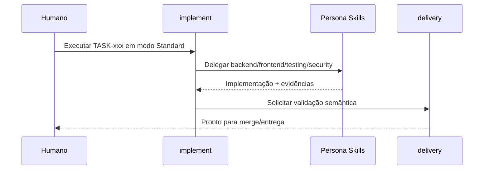
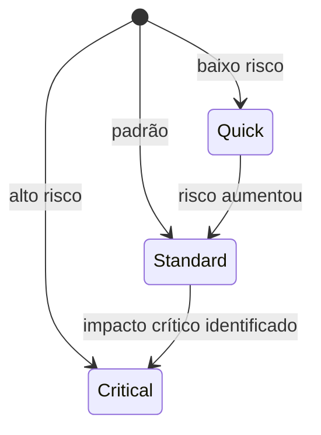

# Guia Rápido do Boilerplate Multi-IA

> Leitura de 10 minutos para sair de `PRE_BOOTSTRAP` até execução contínua de tasks com governança.

## Sumário Executivo

Este boilerplate existe para acelerar desenvolvimento com IA sem perder controle técnico.  
Você ganha um modelo pronto de operação: documentação orientada a produto, memória de execução por task, skills reutilizáveis e governança clara entre validação sintática (CI) e semântica (skills + humano).

Se o objetivo é reduzir improviso, manter rastreabilidade e escalar trabalho paralelo com agentes, este boilerplate já entrega a base.

## Principais Features

- Contrato operacional único em `AGENTS.md`.
- Catálogo de skills interoperável (workflow + persona).
- Gate 0 de bootstrap com estados explícitos.
- Estrutura de memória operacional (`memory-system/`) para tasks, logs e workstreams.
- Modelo de execução por modo (`Quick`, `Standard`, `Critical`).
- Fluxo de entrega com validação semântica via `delivery`.
- Convenção de colaboração paralela com branches/task e worktrees.
- Fonte funcional central em `docs/PROJECT_SPECS.md`.

## Estrutura do Repositório (O Que Importa)

```text
.
├── AGENTS.md                         # Contrato operacional principal
├── docs/
│   └── PROJECT_SPECS.md              # Fonte de verdade funcional
├── memory-system/
│   ├── 1-project-context.md          # Contexto executivo do projeto
│   ├── 2-tasks.md                    # Estado de bootstrap + índice consolidado
│   ├── tasks/                        # Uma task por arquivo
│   ├── task-docs/                    # planning/report/evidências
│   ├── session-log.d/                # Logs append-only por sessão
│   └── workstreams/                  # Notas por fluxo de trabalho
├── skills/                           # Skills de workflow e especialistas
├── boilerplate-docs/                 # Guias do boilerplate
└── src/                              # Código da aplicação (ou */src em monorepo)
```

Arquivos para abrir primeiro:

1. `AGENTS.md`
2. `docs/PROJECT_SPECS.md`
3. `memory-system/1-project-context.md`
4. `memory-system/2-tasks.md`

## Jornada Completa: Bootstrap -> Orquestração


## Etapa 1: Bootstrap e Atualização de Docs

Objetivo: sair do placeholder e criar base mínima consistente.

Skills-chave:

- `bootstrap`: cria/refina artefatos iniciais a partir do `BRIEFING.md`.
- `update-docs`: atualiza docs existentes com edição semântica, sem regenerar tudo.

Exemplos de uso:

- Claude: `/bootstrap iniciar bootstrap a partir do BRIEFING`
- Codex: `Use a skill bootstrap para iniciar o projeto com base no BRIEFING.md`
- Claude: `/update-docs alinhar docs com PROJECT_SPECS e BRIEFING`
- Codex: `Use a skill update-docs para atualizar a documentação sem sobrescrever arquivos inteiros`

Resultado esperado:

- `docs/PROJECT_SPECS.md` com conteúdo real (sem placeholders críticos).
- `memory-system/1-project-context.md` preenchido.
- Estado de bootstrap avançando em `memory-system/2-tasks.md`.

## Etapa 2: Gerar Épicos e Tasks

Objetivo: transformar visão em backlog executável.

Skills-chave:

- `gen-epics`: cria roadmap de épicos priorizados.
- `gen-tasks`: decompõe um épico em tasks rastreáveis e gera os arquivos canônicos em `memory-system/tasks/`.
- `testing` (apoio): valida mapeamento requisito -> critério -> teste.

Exemplos de uso:

- Claude: `/gen-epics propor roadmap baseado no PROJECT_SPECS`
- Codex: `Use a skill gen-epics para gerar e priorizar os épicos`
- Claude: `/gen-tasks decompor EP-001 em tasks com dependências`
- Codex: `Use a skill gen-tasks para criar tasks executáveis para o épico EP-001`

Resultado esperado:

- `docs/EPICOS.md` aprovado.
- `docs/EPICO-<ID>-<slug>-TASKS.md` aprovado.
- tasks canônicas do épico criadas em `memory-system/tasks/`.
- Projeto pronto para `READY_FOR_EXECUTION`.

## Etapa 3: Implementar e Orquestrar Tasks

Objetivo: executar mudanças com governança e evidência.

Skills-chave:

- `implement`: orquestra o ciclo fim a fim da task.
- `backend` / `frontend` / `devops`: execução técnica por domínio.
- `review`, `testing`, `security`: qualidade e risco.
- `delivery`: validação semântica e entrega.



Exemplos de uso:

- Claude: `/implement executar TASK-oda-123 no modo Standard`
- Codex: `Use a skill implement para executar a TASK-oda-123 com foco em rastreabilidade`
- Claude: `/delivery validar consistência e preparar entrega`

## Modos de Implementação e Fluxos

| Modo | Quando usar | Fluxo recomendado com skills |
|---|---|---|
| `Quick` | ajuste pequeno, baixo risco, sem quebra de contrato | `implement` + `testing` + `delivery` |
| `Standard` | modo padrão para evolução normal | `implement` + skills técnicas + `testing/review` + `delivery` |
| `Critical` | segurança, migração, breaking change, alto risco | `implement` + `architect/security/testing/review` + `delivery` com gates explícitos |



Resumo prático:

- `Quick`: velocidade com evidência objetiva.
- `Standard`: equilíbrio entre velocidade e rastreabilidade.
- `Critical`: máxima proteção contra regressão e impacto.

## Skills: Lista Rápida com Exemplo

### Workflow (processo)

- `bootstrap`: inicia projeto a partir do briefing. Ex.: `/bootstrap iniciar bootstrap`.
- `update-docs`: refina docs existentes sem reescrever tudo. Ex.: `/update-docs alinhar docs`.
- `gen-epics`: gera roadmap de épicos. Ex.: `/gen-epics montar EPICOS`.
- `gen-tasks`: quebra épico em tasks executáveis. Ex.: `/gen-tasks decompor EP-001`.
- `implement`: executa task ponta a ponta. Ex.: `/implement executar TASK-xyz`.
- `delivery`: valida semântica e conduz entrega. Ex.: `/delivery validar e entregar`.
- `release`: versiona e controla publicação. Ex.: `/release preparar release`.
- `housekeeping`: organiza estrutura e memória com segurança. Ex.: `/housekeeping organizar docs`.
- `update-upstream`: sincroniza com upstream preservando decisões locais. Ex.: `/update-upstream sincronizar`.
- `gen-skill`: cria/atualiza skill do projeto. Ex.: `/gen-skill criar skill para suporte X`.
- `review-spec`: revisão exaustiva de UM documento de spec via subagentes paralelos. Ex.: `/review-spec docs/PROJECT_SPECS.md`.
- `review-all`: revisão sequencial de TODOS os specs em ordem de dependência. Ex.: `/review-all`.
- `gohorse`: executor padrão de épico — paralelismo via ferramenta Workflow do Claude Code (fan-out de subagentes de implementação em worktrees isoladas) + entrega serial + posse de arquivo "claim-on-first-touch" (cada subagente reserva um arquivo antes do primeiro write; quem disputa um arquivo já reservado adia para a próxima wave, evitando a colisão no rebase de merge). Ex.: `/gohorse EP-001`.
- `gohorse-light`: fallback sequencial e sem dependências do `gohorse` (uma task por vez, via Agent tool). Usar quando o primitivo Workflow/worktree não está disponível. Ex.: `/gohorse-light EP-001`.
- `parallel`: execução paralela de tasks via tmux workers. Ex.: `/parallel EP-001`.
- `xgh`: MVP automático: bootstrap, épicos, tasks e execução gohorse. Ex.: `/xgh`.
- `gen-executive-summary`: gera resumo executivo para avaliação humana. Ex.: `/gen-executive-summary`.
- `solve-issues`: analisa issues/PRs e orquestra implementação via implement+delivery. Ex.: `/solve-issues`.

### Persona (especialidade)

- `architect`: trade-offs e fronteiras técnicas.
- `backend`: APIs, regras de negócio, dados.
- `frontend`: UI, fluxos de tela, estado.
- `testing`: estratégia e evidências de teste.
- `security`: risco, controles e hardening.
- `devops`: CI/CD, deploy, observabilidade.
- `review`: revisão técnica e risco de regressão.

## Como Personalizar o Boilerplate para Seu Projeto

1. Defina sua identidade no `BRIEFING.md` (produto, público, problema, restrições).
2. Converta isso em escopo e critérios objetivos no `docs/PROJECT_SPECS.md`.
3. Ajuste o contexto operacional em `memory-system/1-project-context.md`.
4. Revise aliases de workstream em `memory-system/workstreams/aliases.conf` se necessário.
5. Adicione ou evolua skills próprias com `gen-skill` quando houver repetição de processo.
6. Mantenha `src/` (ou `*/src/`) como área de código de aplicação.

## Cenários Práticos de Uso

### Cenário A: Projeto novo do zero

1. `bootstrap`
2. `update-docs`
3. `gen-epics`
4. `gen-tasks`
5. `implement`
6. `delivery`

### Cenário B: Nova feature backend de risco moderado

1. `implement` (modo `Standard`)
2. `backend`
3. `testing`
4. `review`
5. `delivery`

### Cenário C: Correção urgente de bug pequeno

1. `implement` (modo `Quick`)
2. `testing` (reprodução + validação)
3. `delivery`

### Cenário D: Mudança sensível de segurança

1. `implement` (modo `Critical`)
2. `security`
3. `architect`
4. `testing`
5. `review`
6. `delivery`

## Checklist de Leitura Rápida (Onboarding)

- [ ] Entendi as regras do `AGENTS.md`.
- [ ] Sei onde ficam specs, tasks e logs em `memory-system/`.
- [ ] Consigo explicar quando usar `Quick`, `Standard` e `Critical`.
- [ ] Sei a diferença entre skill de workflow e persona.
- [ ] Sei o fluxo mínimo: `bootstrap -> update-docs -> gen-epics -> gen-tasks -> implement -> delivery`.

---

Se você seguir este guia, já consegue usar o boilerplate com fluxo profissional desde o primeiro dia, com velocidade de IA e disciplina de engenharia.
